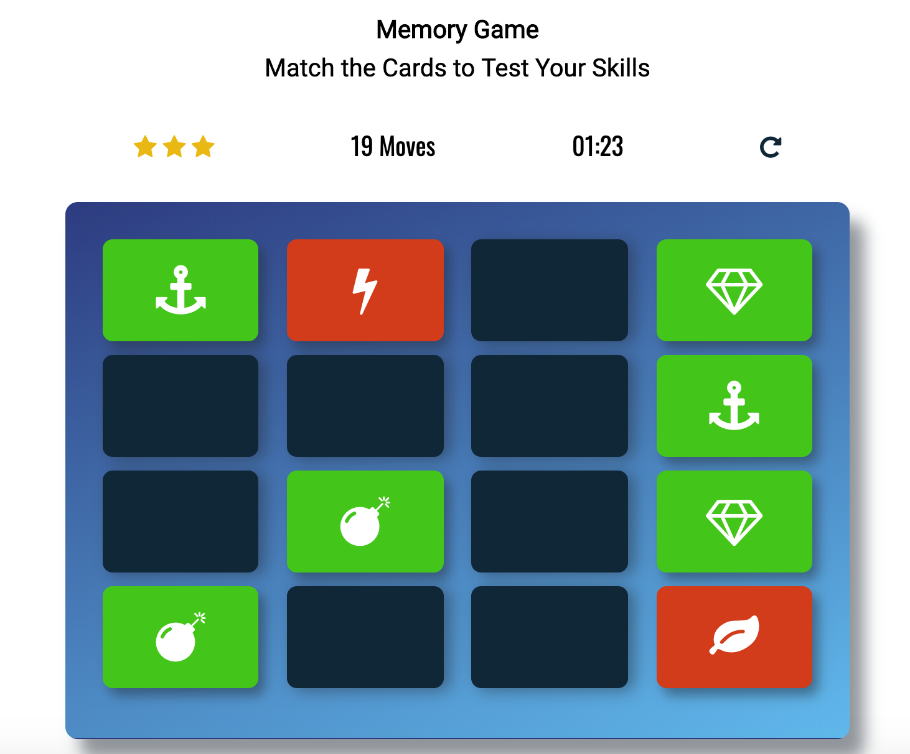

# Memory-Game-App
This is a browser-based card matching game (also known as Concentration).  

## Game Requirements
The game requires a web browser.

## Resources
The game utilizes the following fonts:
  *   (https://maxcdn.bootstrapcdn.com/font-awesome/4.6.1/css/font-awesome.min.css)
  *   (https://fonts.googleapis.com/css?family=Roboto)
  *   (https://fonts.googleapis.com/css?family=Oswald)

## How the Game Works
The game board consists of sixteen "cards" arranged in a grid. The deck is made up of eight different pairs of cards, each with different symbols on one side. The cards are arranged randomly on the grid with the symbol face down. The gameplay rules are very simple: flip over two hidden cards at a time to locate the ones that match!

## Each turn:

   * The player "flips" one card over by clicking on it to reveal a symbol.
   * The player's goal is to find a matching symbol each time they "flip" a card until all matches are found. 
   * The card in every attempt to match the cards turns yellow and the symbol remains displayed until the second card is flipped.   
   * If the cards match, the cards turn green both cards stay flipped over displaying the sybols.
   * If the cards do not match, the cards turn red and both cards are flipped face down.
   * The game ends when the player finds every matching set of symbols.

## Game Animation
The Memory Game App incorporates @keyframes and JavaScript for the following animations and transitions:
### Flipping cards   
   * 3D rotation
#### Matching cards   
   * Pulse     
#### Mismatched cards   
   * Rubberband
#### All cards are matched     
   * Modal
   
#### Contribute
I'm not taking pull requests currently.

#### Acknowledgements
Built with the support of the fabulous Udacity student community
Many thanks in particular to Udacity Grow With Google Slack Community Tutor, @Lloan.

### Contact
Connect with me on linkedIn (https://www.linkedin.com/in/christina-tovar-hamernik/) or Twitter (https://twitter.com/CTovarHamernik)
